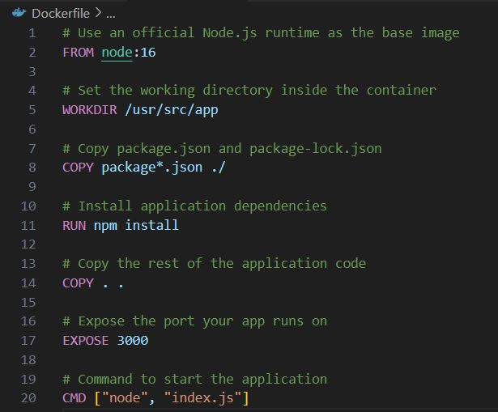
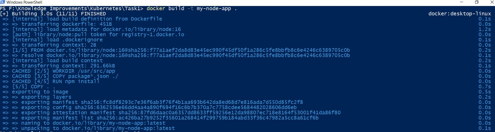
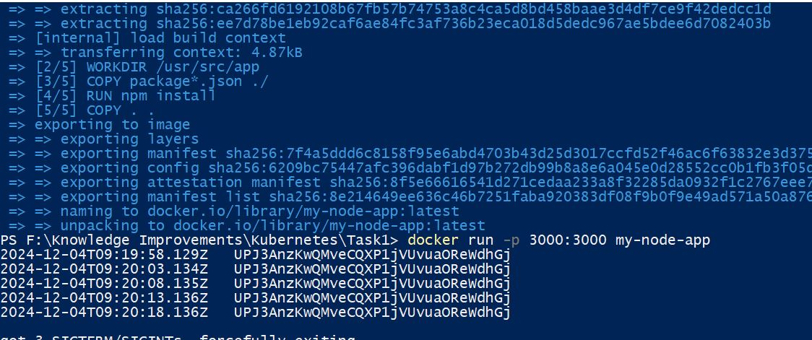

## Start the Docker and Kubernetes

1. k3d cluster create -a 2 : Create a cluster

2. k3d cluster stop : Stop the cluster

3. k3d cluster start : Start the cluster

4. k3d cluster delete : Delete the cluster

## Deployment with Docker

1. Used random-string-generator npm module to generate the random string

2. Update the given sample code to log the output in 5s

3. Use Docker file to create a docker image

4. Run the command "docker build -t my-node-app ." to generate the docker image

5. Run the command "docker run -p 3000:3000 my-node-app" to run the docker image. The result as follows,

